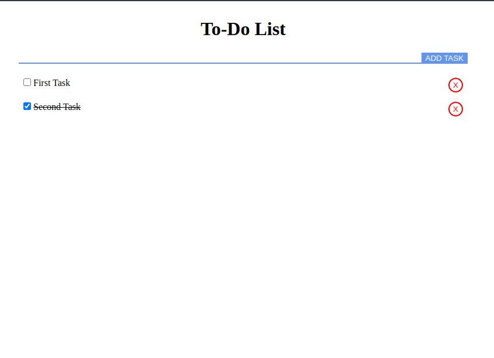

# ScoreKeeper App

## Table of Contents
* [General Info](#general-information)
* [Technologies Used](#technologies-used)
* [Features](#features)
* [Screenshots](#screenshots)
* [Setup](#setup)
* [Usage](#usage)
* [Project Status](#project-status)
* [Room for Improvement](#room-for-improvement)
* [Acknowledgements](#acknowledgements)
* [Contact](#contact)

## General Information
- App is used to keep track of tasks
- The main reason to create this app was to learn JavaScript basics

## Technologies Used
- HTML
- JavaScript
 
## Features
List the ready features here:
- Add task
- Delete task
- Marks task as done

## Screenshots
 
 
## Setup
To run this project copy repository and open index.html

## Project Status
Project is: completed

## Acknowledgements
- This project was part of JetBrains Academy - Frontend Developer track.

## Contact
Created by Karol Kijowski
